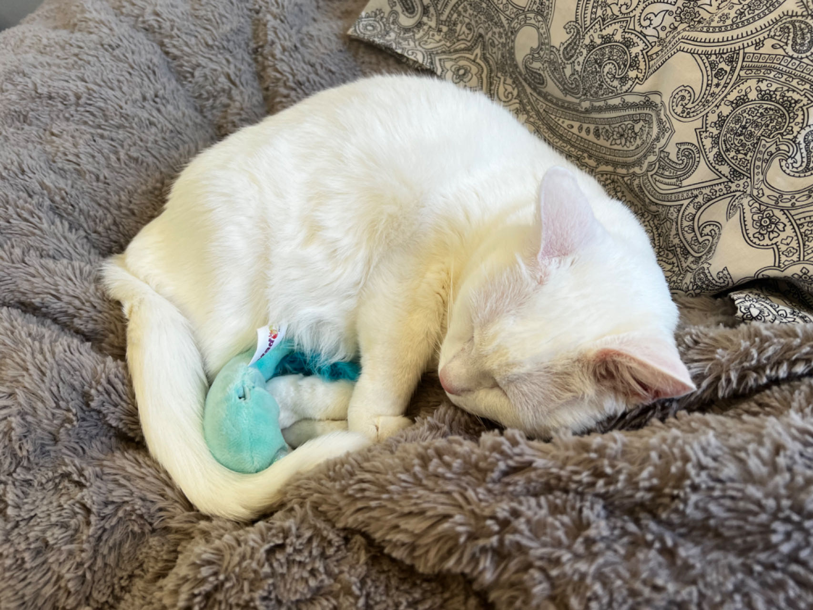
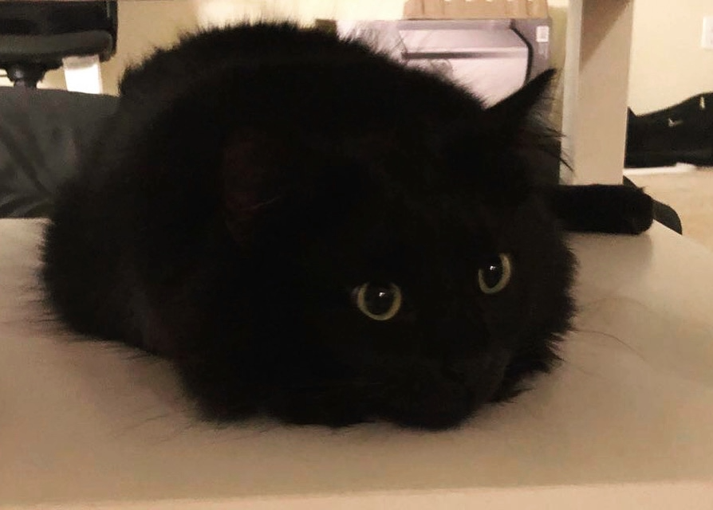
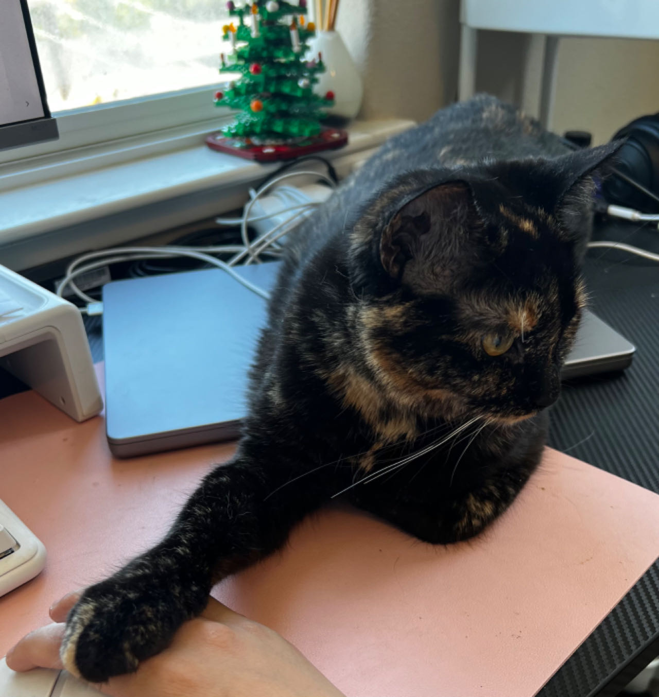

# Cat-Memory-Game

The Cat Memory Game is a multi-page card matching game implemented with [React](https://react.dev/). The game is consists of four pages:

- _**Intro page**_, where it welcomes the user and prompted the user to click the button to go to the preference page.
- _**Preference page**_, where it allows user to select the size of the card deck, and the count down time limits. The user get to mix and match the size and count down time, making it a more user friendly game.
- _**Game page**_, where the user can play the cat memory card game with my beloved cats, Kitty, Normie, and Bangbang. The user can see the current count down time, their current total card turns, and their current match in real time. The user can also press the "New Game" button, if they want to restart the game.
- _**End page**_. This will only show when the user take at least one turn in the game. If the user haven't finished the game, a.k.a, won the card game, the page will show a message saying that the user lost, and they can click the button to try again. However, if they won, they will see a message saying that they win, and if they want to, they can click the button to play again.

---

## Usage:

To clone and run this web application, you will need [Git](https://git-scm.com/).

```
# To clone this repository
$ git clone https://github.com/Victoriakaey/Cat-Memory-Game.git

# Run the app
$ npm start
```

---

## Special Thanks to Kitty, Bangbang and Normie

#### Kitty (2014/03/31 - present)

- Adoption date: 2016/04/12
- Gender: Female
    <!-- - Description: A sweet, smart, friendly and energetic cat, love the color blue and chicken. She will randomly twist her body, act crazy and run around the room. -->



#### Bangbang (2015/03/30 - 2021/06/25)

- Adoption date: 2016/10/24
- Gender: Male



#### Normie (2022/05/16 - present)

- Adoption date: 2022/07/21
- Gender: Female



> Note: Started the project on 09/03/2023, and finished on 09/08/2023
